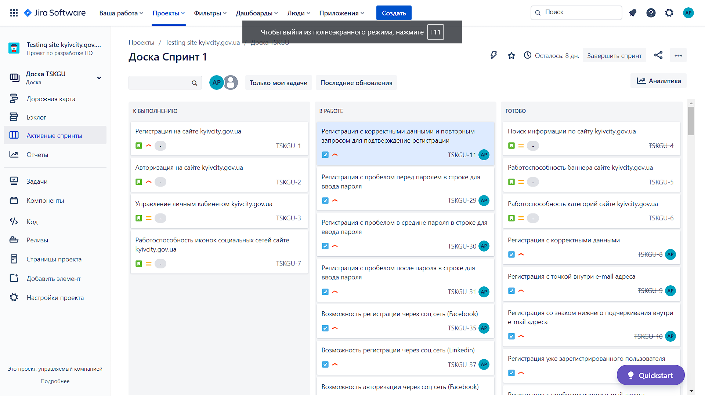
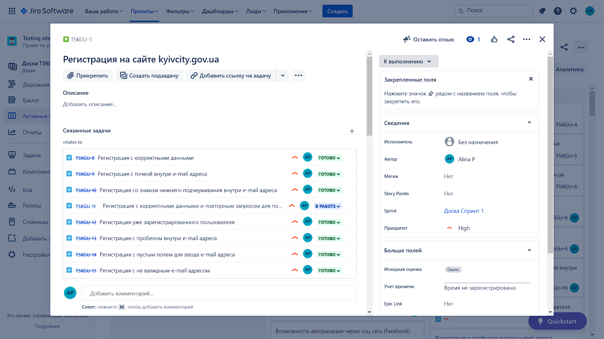

# My test volunteering via jira

### screenshots of the kyivcity.gov.ua website  testing

#### full screens of 1 test :arrow_heading_down:

toggle Screenshot :clapper:

 

toggle Screenshot :clapper:

 

toggle Screenshot :clapper:

 

